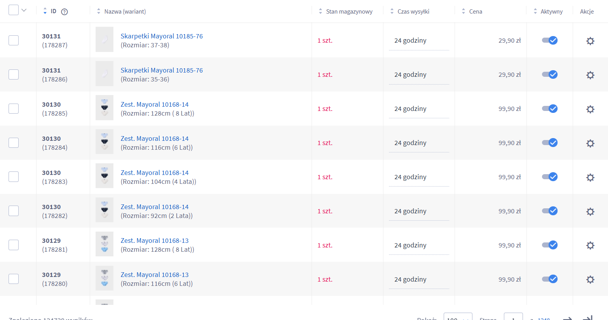

# Shoper Variant Import Automation

Automatyzacja procesu przygotowania i wstawiania wariantów produktów do sklepu Shoper na podstawie eksportów CSV oraz integracji z REST API Shopera.

> Projekt powstał do rozwiązania realnego problemu biznesowego: masowego dodawania wariantów produktów do istniejącego katalogu sklepu bez ręcznego klikania w panelu administracyjnym.

---

## Zakres projektu

Projekt obejmuje:

- import danych produktowych z plików CSV,
- mapowanie produktów z wykorzystaniem REST API Shopera,
- generowanie pliku pośredniego z identyfikatorami produktów,
- automatyczne tworzenie wariantów na podstawie danych wejściowych,
- walidację danych wejściowych i obsługę brakujących mapowań,
- powtarzalny workflow importowy dla procesu e-commerce.
  
---

## Stack technologiczny

- **Python 3**
- **requests** - komunikacja z REST API Shopera
- **pandas** - wczytywanie i przetwarzanie danych CSV w `upload.py`
- **csv / pathlib / argparse** - obsługa plików wejściowych i CLI w `prod_id_get.py`
- **JSON** - budowanie filtrów i payloadów dla API
- **Shoper WebAPI / REST API** - źródło danych o produktach, opcjach, wartościach opcji i stanach magazynowych

---

## Architektura rozwiązania

### 1. Import danych bazowych

Najpierw do Shopera trafia pełny plik produktowy `towar.csv`.

Po imporcie produkty istnieją już w sklepie, ale mają identyfikatory (`product_id`) nadane po stronie Shopera.

### 2. Mapowanie `product_code -> product_id`

Skrypt `prod_id_get.py`:

- wczytuje `war.csv` oraz opcjonalnie `towar.csv`,
- zbiera unikalne `product_code`,
- odpytuje API Shopera filtrowaniem po kodach produktów,
- dopisuje `product_id` do rekordów,
- zapisuje wynik do pliku `war_z_id.csv`.

To jest kluczowy etap, bo kolejne operacje na wariantach wymagają już identyfikatora produktu istniejącego w Shoperze.

### 3. Tworzenie / aktualizacja wariantów

Skrypt `upload.py`:

- pobiera token dostępu do API,
- pobiera opcje i wartości opcji z Shopera,
- mapuje tekst z CSV do odpowiednich `option_id` i `value_id`,
- sprawdza, czy wariant już istnieje,
- wykonuje **insert** albo **update** wpisu w `product-stocks`,
- aktualizuje ustawienia stock / delivery dla produktu bazowego.

---

## Struktura projektu

```text
.
├── prod_id_get.py      # mapowanie product_code -> product_id i generowanie war_z_id.csv
├── upload.py           # tworzenie / aktualizacja wariantów przez API Shopera
├── towar.csv           # plik bazowy produktów importowanych do Shopera
├── war.csv             # plik wariantów powiązanych z produktami bazowymi
└── README.md
```

---

## Format danych wejściowych

### `towar.csv`

Plik bazowy z produktami importowanymi do Shopera. Przykładowo zawiera pola takie jak:

- `product_code`
- `name`
- `price`
- `category`
- `producer`
- `stock`
- `description`

### `war.csv`

Plik wariantów zawierający m.in.:

- `product_code`
- `Nazwa produktu`
- `Kod wariantu`
- `Cena`
- `Stan magazynowy`
- `Opcje (nazwa | typ | wartość)`

Najważniejsze powiązanie między plikami odbywa się przez `product_code`.

---

## Jak działa cały proces

### Krok 1 - import produktów bazowych do Shopera

Najpierw należy zaimportować pełny plik `towar.csv` przez mechanizm importu CSV w panelu Shopera.

Po tym kroku produkty istnieją już w sklepie, ale lokalne pliki nadal nie znają identyfikatorów `product_id` nadanych przez API / system Shopera.

### Krok 2 - wygenerowanie `war_z_id.csv`

Następnie uruchamiany jest skrypt mapujący identyfikatory:

```bash
python prod_id_get.py \
  --shop "$SHOP_URL" \
  --client-id "$SHOPER_CLIENT_ID" \
  --client-secret "$SHOPER_CLIENT_SECRET" \
  --variants "war.csv" \
  --base "towar.csv" \
  --codes-source base
```

Efektem działania jest plik:

```text
war_z_id.csv
```

czyli rozszerzona wersja `war.csv`, wzbogacona o kolumnę `product_id`.

### Krok 3 - wstawienie wariantów do Shopera

Po przygotowaniu danych z identyfikatorami należy uruchomić `upload.py`.

Przed uruchomieniem trzeba ustawić w skrypcie:

- `SHOP_URL`
- `CLIENT_ID`
- `CLIENT_SECRET`
- `CSV_FILE = "war_z_id.csv"`

Przykładowe uruchomienie:

```bash
python upload.py
```

Skrypt:

- mapuje opcje i wartości,
- sprawdza, czy wariant istnieje,
- aktualizuje istniejący wariant lub tworzy nowy,
- ustawia stock, aktywność wariantu i delivery.

---

## Instrukcja uruchomienia lokalnie

### Wymagania

- Python 3.10+
- dostęp do API Shopera
- `client_id` i `client_secret`
- dane produktowe w CSV

### Instalacja zależności

```bash
pip install requests pandas
```

### Uruchomienie

1. Zaimportuj `towar.csv` do Shopera.
2. Wygeneruj `war_z_id.csv` przy pomocy `prod_id_get.py`.
3. Ustaw poprawne dane konfiguracyjne w `upload.py`.
4. Uruchom `upload.py`.
5. Zweryfikuj wynik w panelu Shopera.

---


## efekt końcowy w panelu Shopera




